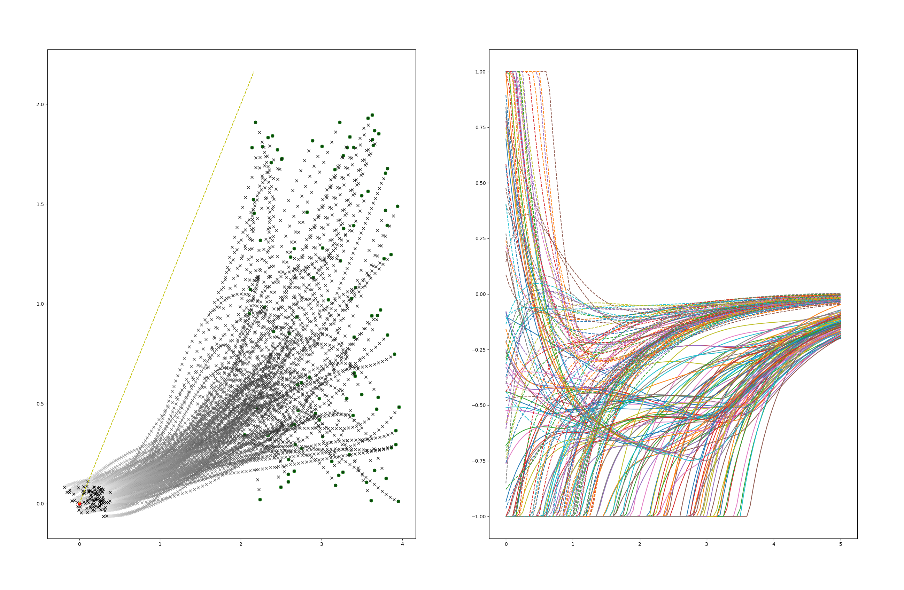
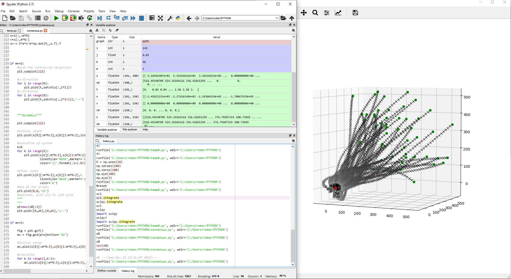
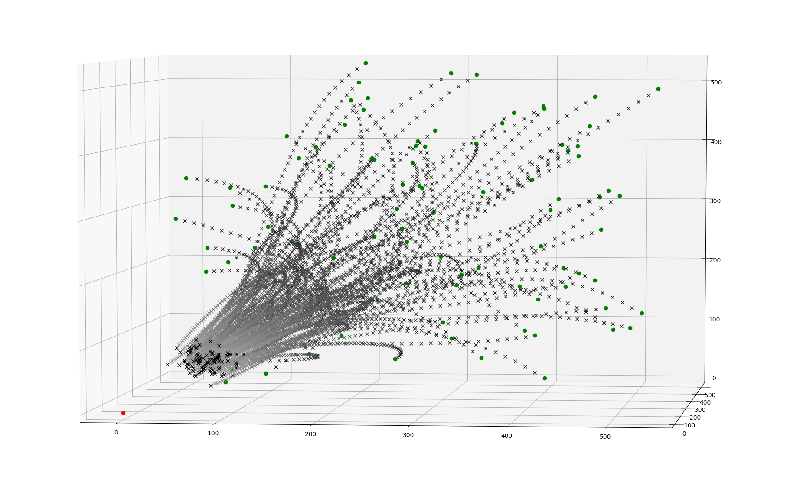

# My First Python Script



```python
"""
Created on Tue May 9 15:14:42 2015
@author: Robbie Cunningham
"""
```
## Setup




```python
#preliminaries

import numpy as np
import matplotlib.pyplot as plt
import scipy as sci
```
## Parameters
This python script was my first introduction to computer programming in general.  It was a program meant to display and capture data about N autonomous agents in space, whose dyamics were dictated only by the knowledge of the dynamics of their neighbors.  The parameters involved allow the user to choose how many agents are involved in the system, the window of time the system should evolve in, and either to run the program in 2 or 3 dimensions. 

```python
"""parameters"""

#number of agents
N=100
#which graph?
graph = 'path'
#final time
T=10
#time incriment
j=.2
#optimality gain
a=.4
#consensus gain
b=1
#saturation bound (Delta)
D=7
#dimension, either 2 or 3
m=2
```

## Network Topology
The topology of the supposed mesh network that the agents used to communicate each others positions an velocities is determined by a particular type of graph (fancy math wor for dots and lines).  For example, a 'star' graph on N nodes (dots) is one where each node is connected to every other node by a vertex (line).  The function "laplacian(x)" is meant to return the Laplacian of the graph "x," where x is a string representing the graph by its name, like "star," or "path" (a graph that looks like this: *-*-*-*-*).

```python
#an array of choices for network topology

def laplacian(graph,N):
    if graph=='complete':
        L=-np.ones((N,N))
        for i in range(N):
            L[i,i]=N-1
    if graph=='path':
        L=2*np.eye(N)
        L[-1,-1],L[0,0]=1,1
        for i in range(N-1):
            L[i,i+1],L[i+1,i]=-1,-1
    if graph=='star':
        L=np.eye(N)
        L[:,0],L[0,:]=\
         -np.ones(N),-np.ones(N).T
        L[0,0]=N-1
    if graph=='cycle':
        L=2*np.eye(N)
        for i in range(N):
            L[i,i-1],L[i-1,i]=-1,-1
        
    return L

```

The agents are dispersed randomy in a cube away from the origin, and set to have no initial velocity

```python
#initial states (v(0)=0)

if m==2:
    x0=2*np.random.rand(m*N)
    x0[::2]+=2
    #x0[1]+=4

if m==3:
    x0=500*np.random.rand(m*N)
    for i in range(len(x0)):
        x0[i]+= 30

v0=np.zeros((m*N))

#concatinate s=(x v)

s0=np.array([x0,v0]).reshape(2*m*N)

```
## Calculus
The actual mathematics happens when we take the arrays of inital positions, velocities and the matrix that represents their network topology, an define and solve the ODE that represents the situation, which I came up with btw!

```python

#define the ODE   

def f(s,t):
    x=s[:m*N]
    v=s[m*N:2*m*N]
    dx=satch(-v-2*a*x-b*np.dot(M_,x))
    dv=a*b*np.dot(M_,x)
    return np.array([dx,dv]).reshape(2*m*N)
t=np.arange(0,T+1e-10,j)

#solve the ODE

t=np.arange(0,T+1e-10,j)
s=sci.integrate.odeint(f,s0,t)

```
## The plot
```python
"""plotting the controlled velocities"""

plt.subplot(122)

#x-direction
for i in range(N):
    plt.plot(t,satch(u[:,2*i]))
#y-direction
for i in range(N):
    plt.plot(t,satch(u[:,2*i+1]),'--') 


"""plotting the physical dynamics"""


plt.subplot(121)


#initial state
plt.plot(s[0][:m*N:2],s[0][1:m*N:2],\
    linestyle='None',\
    marker='o',\
    color='g')


#evolution of system
k=0
for k in range(K):
    plt.plot(s[k][:m*N:2],s[k][1:m*N:2],\
             linestyle='None',marker='x',\
             color='{}'.format(.1+(.8+(1/K))*(k/(K-1))))


#final state
plt.plot(s[K][:m*N:2],s[K][1:m*N:2],\
             linestyle='None',marker='x',\
             color='k')


#dot at the origin
plt.plot(0,0,'ro')


#optional, plot y=x in left plot

"""
pt=max(x0[:2])
plt.plot([0,pt],[0,pt],'y--')
"""


plt.show()
```
## Three Dimensions



The system is not only scalable in the number of agents one can include in the scheme, but also whether or not they want to play it out in 2 or 3 dimensions.  In fact, the findings from this study have been used to model this behavior in as many dimensions as you wish, which can be a practical way to uncover new insights in the way the values of different types tend toward some value over time. 

```python
fig = plt.gcf()
ax = fig.gca(projection='3d')

#initial state
ax.plot(s[0][:m*N:3],s[0][1:m*N:3],s[0][2:m*N:3],\
        linestyle='None',\
        marker='o',\
        color='g')

#evolution
for k in range(1,K-1):
    ax.plot(s[k][:m*N:3],s[k][1:m*N:3],s[k][2:m*N:3],\
        linestyle='None',\
        marker='x',\
        color='{}'\
        .format(.1+(.5+(1/K))*(k/(K-1))))

#final state
ax.plot(s[K][:m*N:3],s[K][1:m*N:3],s[K][2:m*N:3],\
        linestyle='None',\
        marker='x',\
        color='k')

#origin
ax.plot([0],[0],[0],linestyle='None',marker='o',color='r')

plt.show()
```
    
